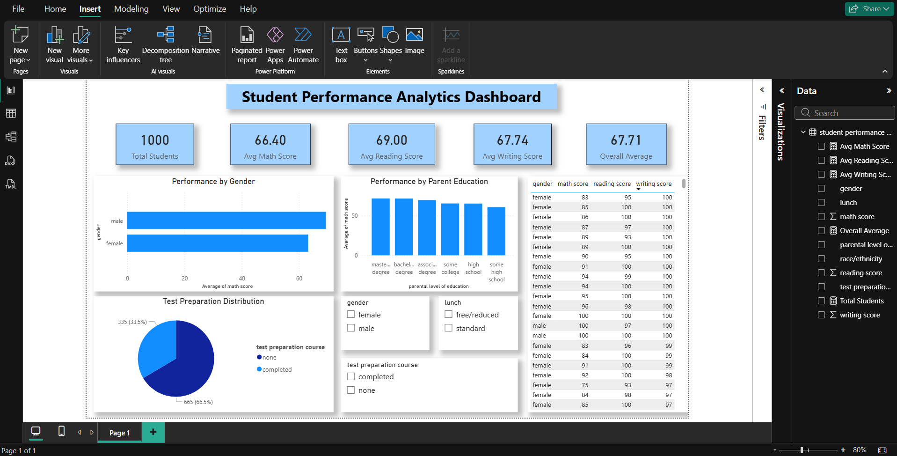

# Student Performance Analytics Dashboard

## Overview
This project is an interactive Power BI dashboard that analyzes student academic performance based on gender, parental education, lunch type, and test preparation course.

## Tools Used
- Power BI
- DAX
- CSV Dataset

## Key Metrics
- Total Students
- Average Math Score
- Average Reading Score
- Average Writing Score
- Overall Average Score

## Visualizations
- Performance by Gender
- Performance by Parent Education
- Test Preparation Participation
- Interactive Filters
- Student Score Details

## Dashboard Preview

## Project Files
- Student_Performance_Analytics_Dashboard.pbix
- StudentsPerformance.csv
- dashboard.png
